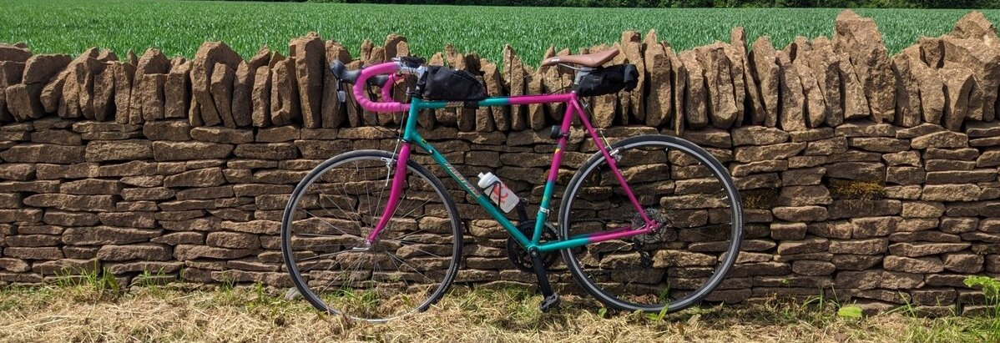

[From the 1990s catalogue:](https://dawescycles.wordpress.com/portfolio/1990-catalogue/)
> The Street Wise is definitely hot in the city. The touring frame's constructed by hand with Reynolds 501 butted main tubes and Unicrown forks. A Street Wise choice of lightweight components include Shimano Exage 300 LX 21-speed transmission with STI levers; Hyperglide and Superglide functions; Biopace chainrings and slar brakes. Pain work is a ping green split and a ladies open frame version is available.
Get Street Wise and ease on down the road.