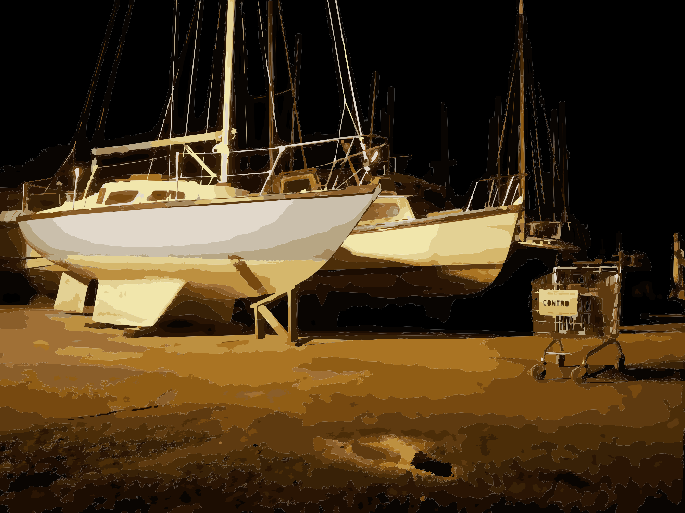
300K Audax

This was the longest yet and most difficult. 
Starting at 10PM on Friday I had the day off work and was planning to sleep during the day. Unfortunately my terrible ability to sleep meant I just lay in bed from 4-7:30 trying to sleep. 
So I didn't get the sleep I wanted, but I was used to this for Audax'. I always end up too excited to sleep. So I liked to think I could still do it even without the adequate sleep.

## Preperation and Gear
I'd been planning this for a while and it had been the main focus of my life for a couple of weeks. 
I was worried about what I needed to bring and how I'd bring it. Stories of last years below freezing temperatures (seemingly decreased every time I was told about it reaching -10 degrees) had me scared.
My plan was to keep it light-ish. On the butt buster I overpacked with a 14l saddle pack packed with who knows what, none of which I actually used. 

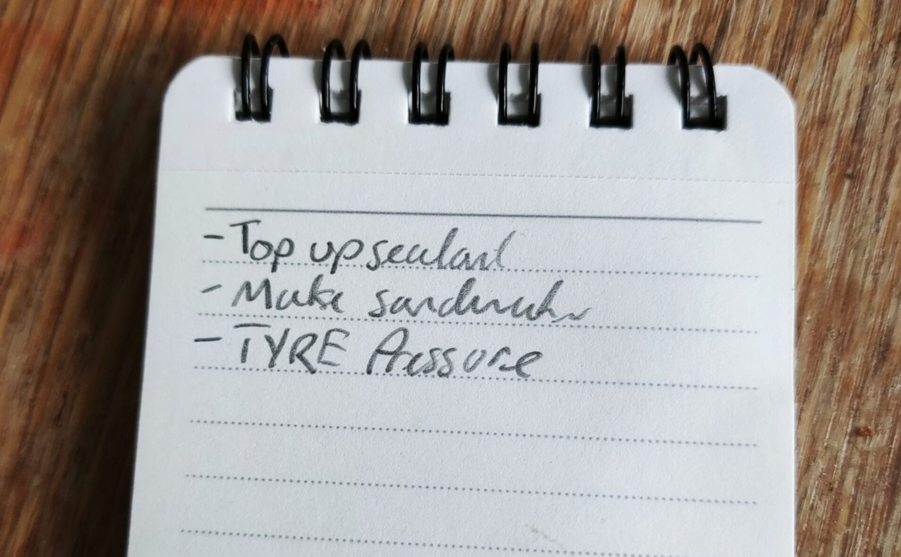

My main concern was having enough layers and having enough space to store layers if I needed to remove them. The latter not being an issue at all in the end.

What I settled on was a [carradice super C rack pack](https://carradice.co.uk/products/super-c-rackbag)! (£25 from ebay) and of course for that I'd then need a pannier rack to fit it. I settled on a Tortec Ultralite weighing 560g (£10 Facebook marketplace). This combined with my expensive tailfin framebag gave me enough space for everything I needed.

I was very pleased with these purchases and especially finding the exact rack I wanted on Facebook for cheap.

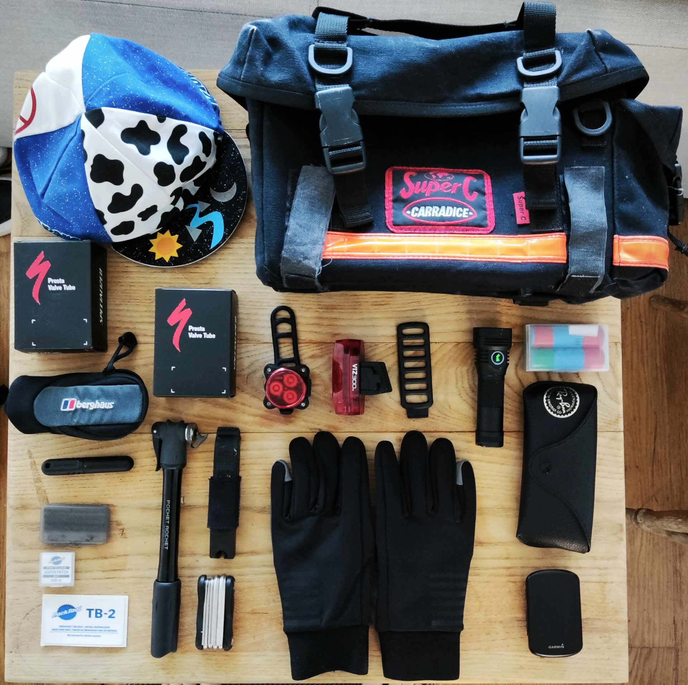

The other issue giving me anxiety was the lighting situation. I'd never cycled through the night and required lighting for this kind of duration. I have been using a Lumintop B01 for some time and have found it to be a very dependable light for most situations. The only issue being the mounting of the light. The good thing about it is it takes a standard 21700 battery you may find in a vape. So I just purchased two additional batteries. Running on high I should get at least 5 hours out of each battery giving me additional time either side for whatever issues I may encounter.

For the rear light I have a cateye ViZ300 giving me 35 hours of flashing rear light action.

### For food:
- 4 Bacon sandwiches 3 rashers each with Tiger bread white loaf and generous ketchup (I was going for max sugar bread)
- 1 Strykr carb drink mix
- 1 Styrkr carb + Caffeine mix
- 3 Knoppers for enjoyable sugar consumption
- 4 various gels (Only for emergency use)

### Clothing Sponsored by YKYWBIKE (not really)
The other consideration was the temperature. I purchased all my new kit from ykywbike as they are cheap. I previously purchased some bib trousers which I have found to be excellent value so I went all in.
- [Shoe covers 33.99](https://www.ykywbike.cc/products/ykywbike-cycling-shoe-covers-neoprene-waterproof-winter-thermal-warm-full-bicycle-overshoes-for-men-women-road-mountain-bike-boo)
- [Gloves 29.99](https://www.ykywbike.cc/products/cycling-gloves-winter-full-finger-waterproof-skiing-outdoor-sport-bicycle-gloves-for-bike-scooter-motorcycle-in-the-cold)
- [Thermal Jacket 60.99](https://www.ykywbike.cc/products/ykywbike-winter-cycling-jacket-outdoor-warm-fleece-coat-thermal-bike-jacket-mtb-bicycle-jersey-weatherproof-windbreaker-5-color)

I will test these a bit more to write a more meaningful review.

## Start
Starting at the Felix adventure park it was an amazing atmosphere. My depature slot was 22:20 but I wanted to start with ym friends so I bumped myself up to 22:00

Each wave gets funneled into a basketball court and receives a briefing. 

|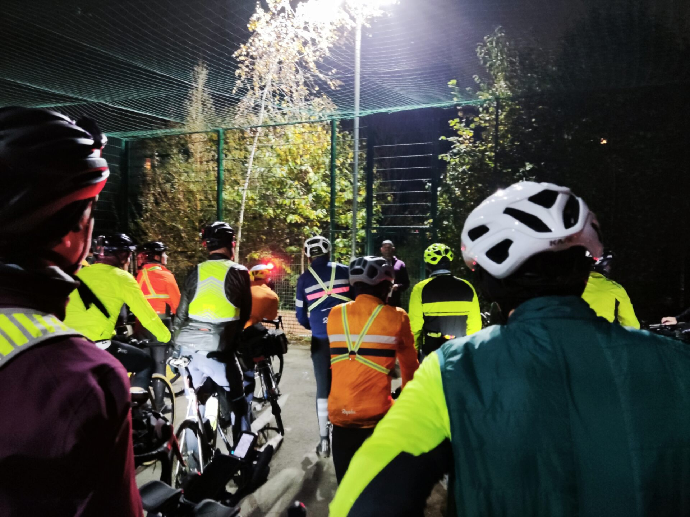  |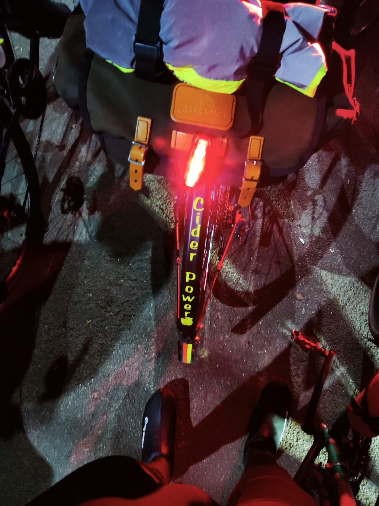  |
|----|----|
*all of my photos are pretty terrible of this event*

The start was fantastic, it's always amazing cycling in these large groups. It can be slightly chaotic but always fun.

But everyone doesn't stay together forever, groups will slowly form and spread out.

## 0-50 12:15AM
The first 50k went very fast. Everyone has the most energy and the most excitement. It was amazing. We were in devizes before we knew it.
So far it wasn't too cold and there were no issues. The first stop had plenty of flapjack and hot drinks.
I just had a double slice of flapjack and we were ready to go.
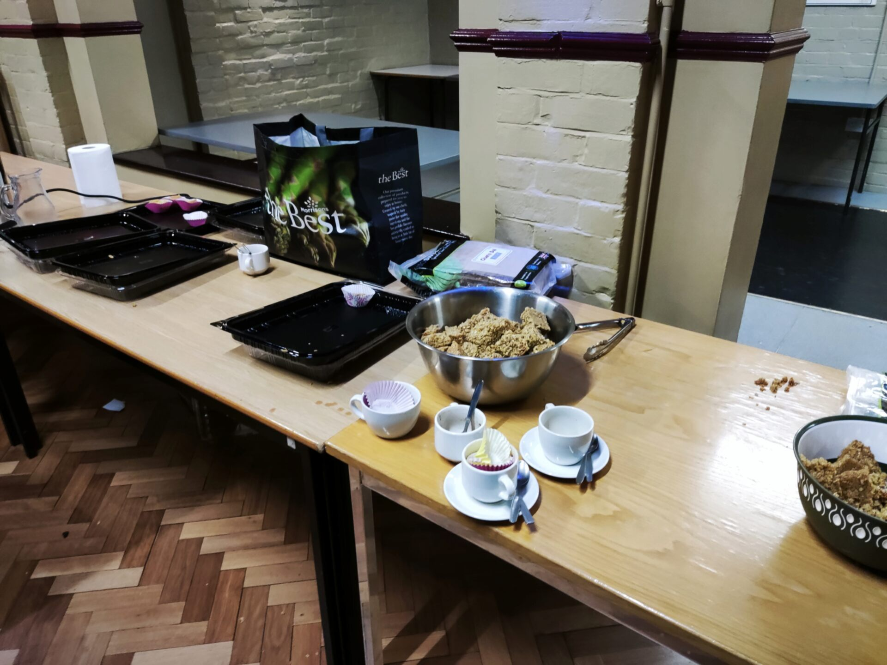

## 50-100 2:28AM
Again 50-100 flew buy, and I couldn't believe we how quickly we made it to the next stop.

This is when I started to realise the full breadth of cake available. I did such a poor job of photography I don't have any photos of the platters available. But it was magnificent. 

The cold was starting to get to my hands and I couldn' feel them. Luckily I had brought my [LaRon's buckskin gloves](https://ronsbikes.com/products/buckskin-gloves?variant=39715448193112) which happened to fit perfectly over my new ykyw gloves. 

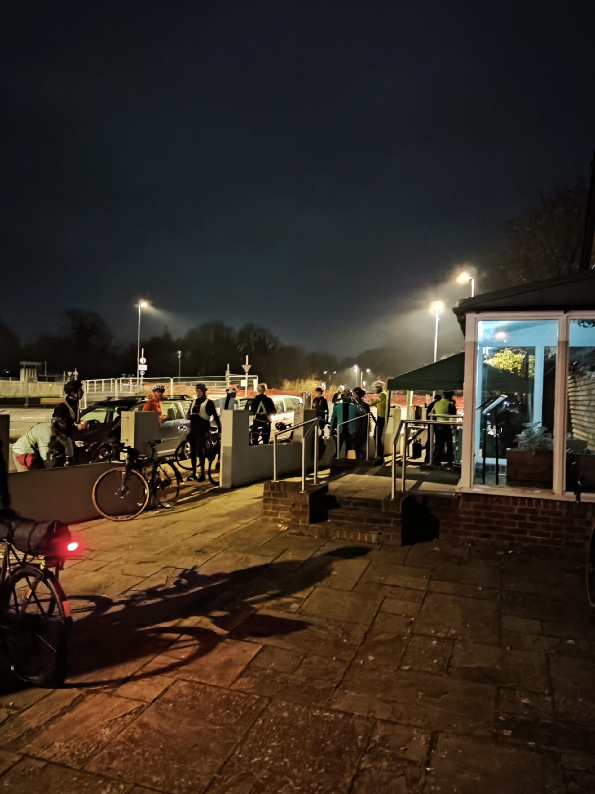

## 100-150 4:20AM
This is where I started to feel tired. 

The next control was at a petrol station so I was just constantly on the lookout for every petrol sation. It always seemed like it wa the next one.

Huddled around the corner we had some quick snacks a lucozade sport.

At this stop I went for my Styrkr caffeine mix. I was trying to hold off caffeine for as long as posible to retain it's effects.

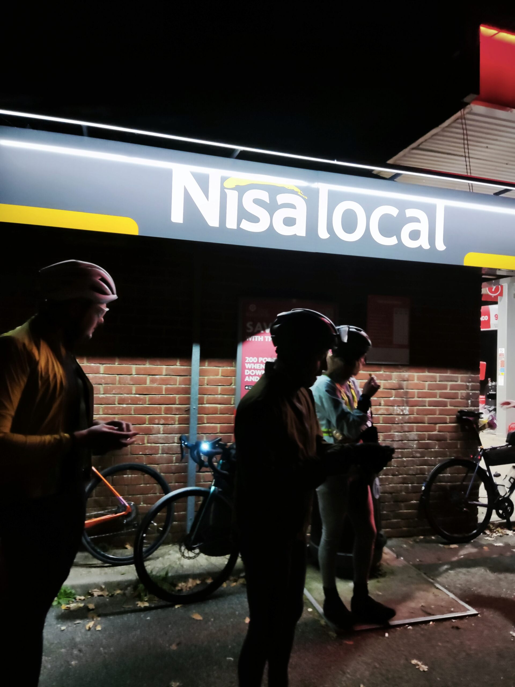

## 150-200 5:30AM
We finally made it to Poole. This was to be the light on the horizon as we knew there would be breakfast.
My favourite part of this leg was riding along the Bournemouth beach. Although it seemed to go on for an eternity, it was very serene with the sound of the waves by my side.

I couldn't eat my beans fast enough. 

At this point I was thorougly tired, but it didn't seem to matter, it was the tirednes that could be ignored.

|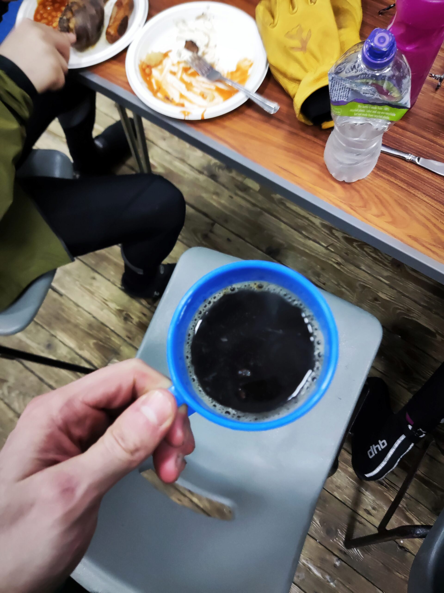|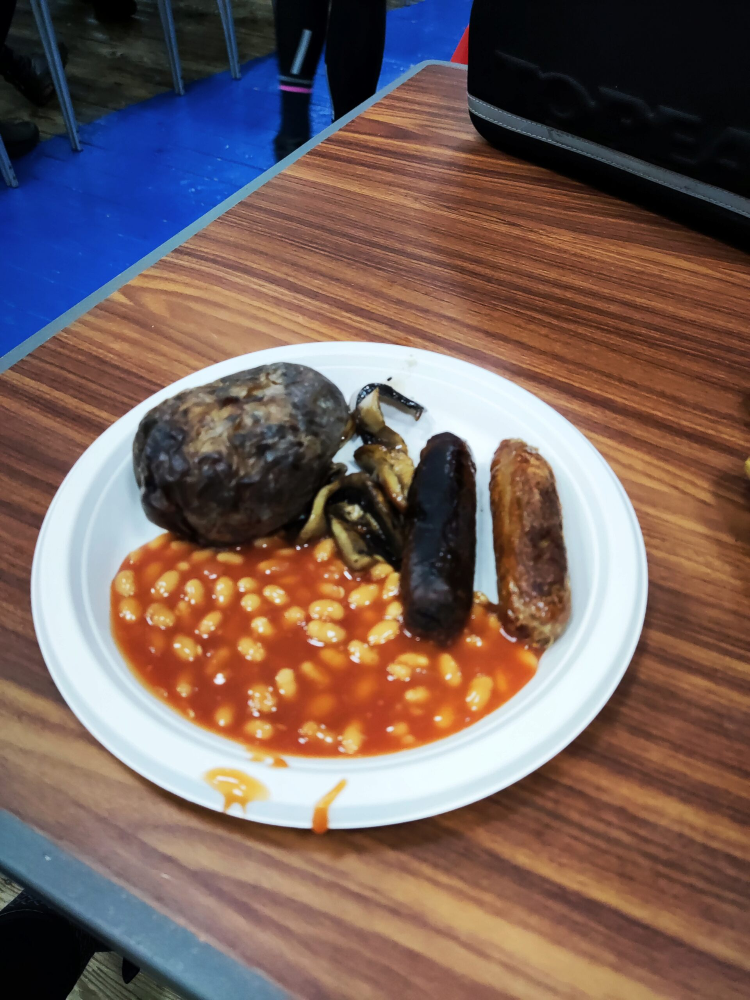|
|-|-|

## 200-250 7:30AM
Another stop at the View Coffee Shop. At this point I wanted as much caffeine as possible. So I had a double espresso.

This is when I started to have some knee pain.

## Podimore 10AM
My biggest regret here was no getting a whopper and fries. I had a bacon sandwich.

I decided now was time for my secret weapon a monster energy Australian lemonade. I filled up my water bottle for the next leg of the journey.

Before we left I decided to lower my saddle 5mm which I believed would help my knees, I was wrong.

## Journey to Yatton
This was the hardest part for me, and it seemed to go on forever. It felt like we'd never reach the cafe along the never ending gravel path. I was certainly glad I was tubeless for this section.  
The monster energy somewhat got me through, A little nauseous from the sugary concoction, but it did the job.

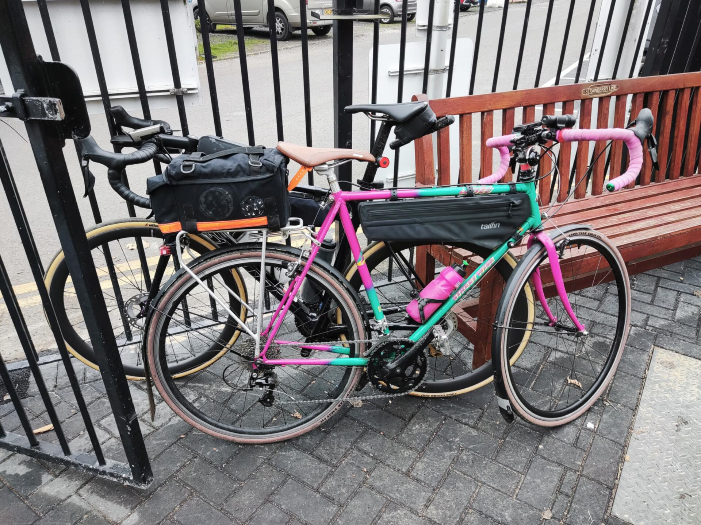

## The final stretch
Well it only got harder. My knees were in a lot of pain at this point and became a lot harder to ignore, but as we went on I was really struggling with it. I tired to keep as straight and steady as possible, any irregular movement caused a sharp pain. 

Getting back into Bristol I thought about going home as the route went past my house. It was only 5k to the finish, but I thought I'd be happier to sit on the sofa than continue. Of course I didn't, and we made it back to the adventure pack.

I wanted to get a team photo at the end, but I entirely forgot. I handed in my brevet ate my dahl and limped back to my bike. 

## Takeways
- 2 sandwiches would probably be fine.
- More caffeine products
- Better bike fit
- YKYW gloves aren't quite warm enough

For some people this is a drop in the bucket of long distance cycling. For me, this was my next step up in testing and pushing myself further. If it weren't for my knees I think I would have found it a little easier. So I need to perfect my bike fit as best I can and perhaps do some knee exercises.
