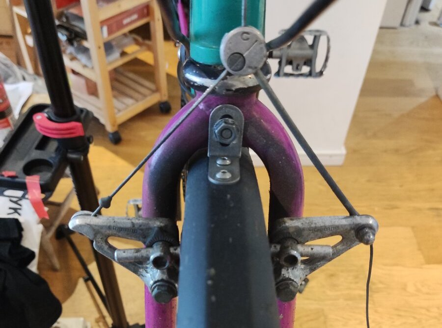
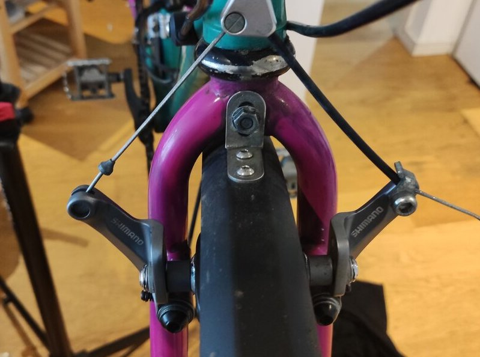

Replaced front cantilever with a newer less complicated Shimano CX-50. Increases braking power and adds the feature of a quick release so I don't have to deflate the tyre when removing the wheel.

|  |  |
|-------------------------------------------|-------------------------------------------|
| BR-AT50                           | Shimano CX-50                           |
